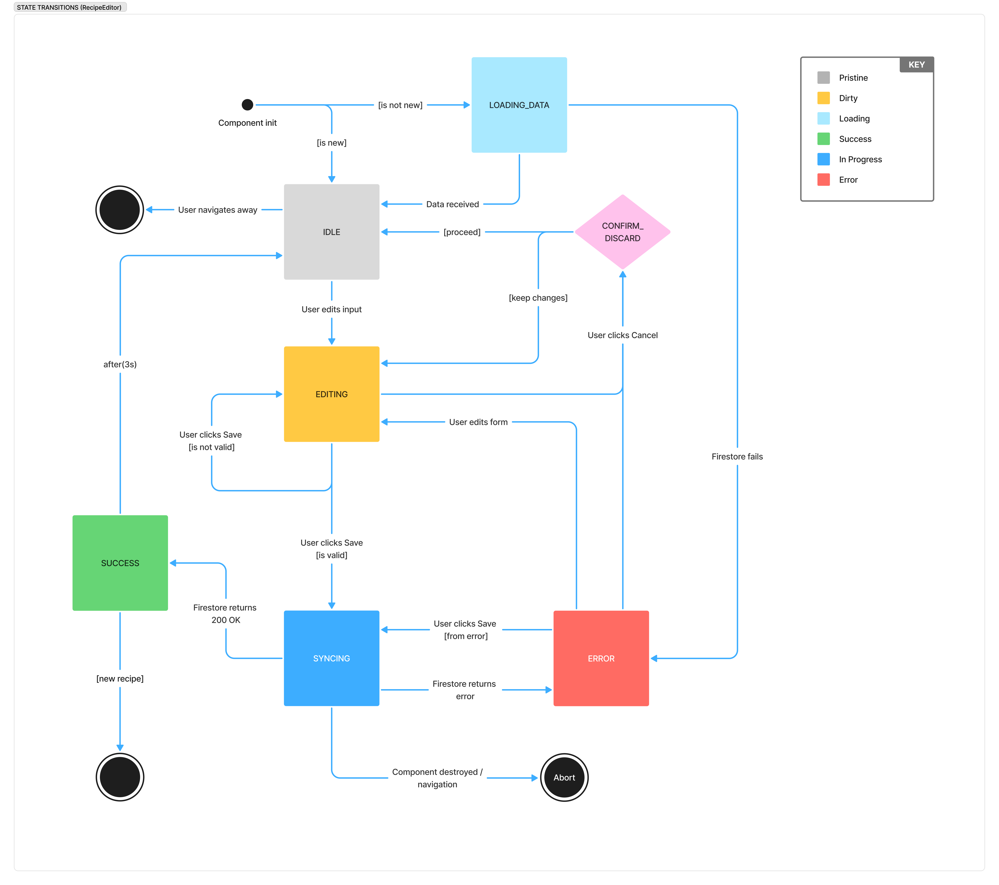
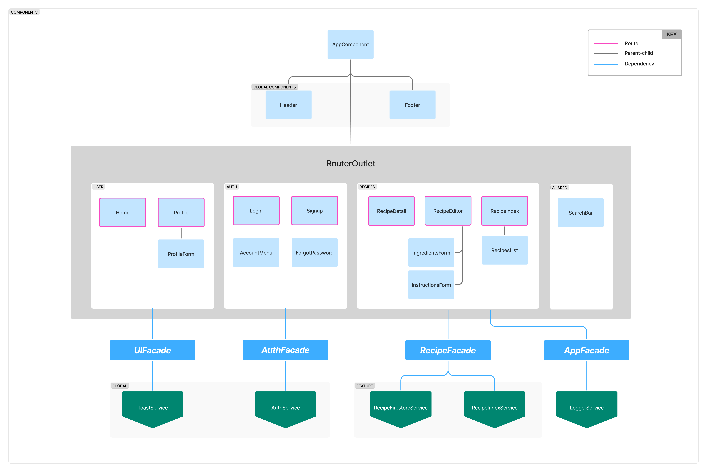

# Pinch

A recipe management tool for home cooks to create, organize, and refine recipes. Designed to feel like a digital logbook — simple, structured, and built to evolve over time. This project was developed for two purposes: to provide a practical utility for everyday cooking and to serve as a comprehensive deep-dive into Angular architecture and RxJS patterns.

Live site: https://pinchthis.com \
A sample **[public recipe](https://pinchthis.com/demo)** without creating an account

## Built with

### Frontend
- Angular
- TypeScript
- Tailwind CSS

### Backend & Services
- Firebase Authentication (Google OAuth + email/password)
- Cloud Firestore (user data and recipes)
- Firebase Hosting

## Features
- **Recipe Management:** Full CRUD operations with real-time data synchronization, automatic dirty checking, and optimistic UI updates.
- **Smart Search:** Full-text search across recipe titles, ingredients, and instructions with instant suggestions and multi-term support
- **User Authentication:** Secure sign-in with Google OAuth or email/password
- **Public Sharing:** Share recipes via public links while maintaining private drafts
- **Mobile-First Design:** Responsive layout optimized for use in the kitchen on phones and tablets

## Project Vision
- **Architectural Elegance**: Implement robust architecture patterns including facade pattern, state machines, and reactive programming
- **Practical Application**: Deliver a reliable tool that solves real kitchen management challenges with thoughtful UX
- **Maintainable Design**: Build well-structured codebase with clear separation of concerns and comprehensive documentation
- **Iterative Development**: Create a solid foundation for ongoing feature development and architectural improvements

## Technical Architecture

### Recipe Editor State Transitions
To ensure UI predictability and data integrity, the Recipe Editor follows a strict state machine pattern. This handles complex logic like dirty-checking, asynchronous syncing with Firestore, and error recovery.

*State machine ensuring UI predictability during recipe editing operations with proper cleanup and memory management*

### Component Architecture

The application is built using a **Feature-First modular architecture**. This ensures a clear separation of concerns (SoC), making the codebase easier to scale and test.

### Architectural Highlights
- **Feature Modules**: Logic is encapsulated within domain-specific folders (Recipes, Auth, User).
- **Facade Pattern**: Components interact only with Facades, abstracting the complexity of state management and external services.
- **Shared Layer**: Reusable UI components (like the SearchBar) are centralized for consistency across features.

  
*Feature-first modular architecture with facade pattern implementation and centralized state management*

## Performance
- **Standalone Components**: Modern Angular standalone components for better tree-shaking and reduced bundle size
- **Reactive State Management**: RxJS-based observables with async pipe for optimal subscription handling
- **Search Optimization**: Client-side recipe indexing for instant search results and suggestions
- **Change Detection**: OnPush strategy where applicable to minimize unnecessary DOM updates

## Deployment
- **Firebase Hosting**: Static site hosting with automatic deployments from main branch
- **Single-Page Application**: Client-side routing with Angular Router for smooth navigation
- **Progressive Web App**: Mobile-optimized responsive design for kitchen use scenarios
- **Offline Capable**: Firestore offline persistence for reliable access during cooking sessions